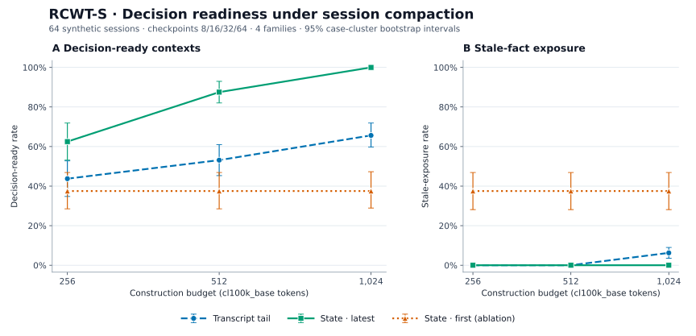
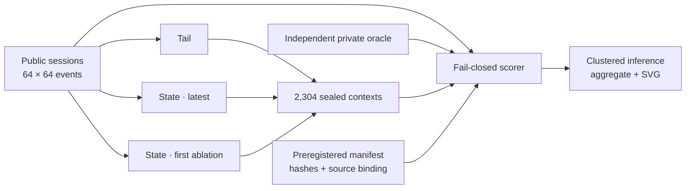

# RCWT + RCWT-S: Measuring Coordination Overhead and Session-State Survival

This repository contains the code and aggregate data needed to reproduce the
reported RCWT measurements.

## RCWT-S: critical-state survival under session compaction

RCWT-S extends the original single-call RCWT artifact into one of the
session-level gaps named by its authors: whether long agent traces retain the
facts needed for the next decision. It compares three deterministic context
policies under identical maximum token caps:

- transcript tail;
- versioned latest state with dependency closure;
- versioned first state, an intentionally stale ablation.

The confirmatory run contains 64 synthetic sessions, 4,096 events, 256
checkpoints, three budgets, and 2,304 scored contexts. The protocol and decision
gates were frozen before the full run.

| Treatment | Decision-ready | 95% case-cluster CI | Mean tokens |
|---|---:|---:|---:|
| **Latest state** | **83.3%** | 79.0–87.6% | 541.1 |
| Transcript tail | 54.2% | 47.0–61.3% | 525.8 |
| First state (ablation) | 37.5% | 28.5–46.9% | 537.7 |

The paired latest-state gain over tail was **+29.2 percentage points** (95%
cluster-bootstrap CI +24.6 to +33.6). At 1,024 tokens, latest state reached
100.0% decision readiness versus 65.6% for tail. The result did not come from
giving latest state less content: it used 15.3 more tokens than tail on average
while filling residual capacity with recent, dependency-closed events.



### Closed-loop evidence path



The builder never receives the oracle. The runner seals the generated context
digest before interpretation, and the scorer reconstructs every header, query,
event line, token count, source-case hash, and treatment cell from the public
corpus. Re-hashing an altered query or invented event still fails validation.

### Reproduce RCWT-S

No model API key is used.

```bash
make verify-session
```

The expanded commands are locked in the
[preregistration](docs/rcwt_session_preregistration.md). The full confirmatory
[result report](results/session_v1/RESULTS.md), aggregate JSON, public corpus,
separate oracle, sealed contexts, manifest, and deterministic SVG are committed.

### What the result means — and does not mean

Within these fixtures, versioning and dependency closure preserve current
decision-critical evidence materially better than transcript recency alone.
All preregistered checks passed, including zero fabricated sufficiency across
576 insufficient-evidence contexts and a positive chronology control.

This is an isolated memory-compaction primitive, not a claim about general LLM
quality or production agent performance. Events are synthetic and structured;
entity, field, supersession, and dependency metadata already exist. RCWT-S does
not measure semantic extraction from raw conversations, tool reliability,
customer outcomes, or the net value of multi-agent coordination. A cold first
load may populate tiktoken's pinned vocabulary cache over HTTPS.

## Contents

```text
src/                         experiment runners and analysis scripts
results/                     aggregate CSV/JSON summaries and figures
docs/                        preregistered session protocol
requirements.txt             pinned Python dependencies
Makefile                     local verification entrypoints
```

## Original RCWT findings represented by the artifact

1. **Fixed-budget RCWT:** at `W=4096`, the main context-dependent recall task
   stays near baseline through moderate overhead and degrades sharply when the
   residual reference block falls to a few hundred tokens.
2. **Residual-budget interpretation:** window-scaling summaries are consistent
   with a task-specific remaining-task-budget estimate, not a fixed percentage
   threshold. Corrected full-budget logistic midpoints are `0.838` for Gemini,
   `0.841` for Haiku, and `0.861` for GPT, corresponding to approximately
   `665`, `650`, and `568` residual task tokens. This is descriptive, not a
   universal law.
3. **Intact-task ablation:** when the full task/reference block is kept intact
   and coordination tokens are added by increasing total prompt length, all
   150 calls return every scored field correctly (1200/1200 fields) across
   tested coordination ratios up to 95%. This is evidence against a large
   cliff-sized semantic-interference effect in this extraction-style setup, not
   proof of zero effect or of behavior on harder open-ended tasks.
4. **Boundary tasks:** self-contained algorithmic tasks remain stable, while
   passage-heavy packs require larger residual task budgets. Claude Haiku 4.5
   on the untruncated GSM8K pack is a reported exception to a truncation-only
   account.

## Suggested applications

- **Context-budget regression tests:** run RCWT-style checks when prompt
  templates, tool outputs, memory summaries, or agent transcripts grow over
  time. The useful signal is not only accuracy, but the residual task budget at
  which accuracy starts to fall.
- **Coordination-format comparisons:** compare free-form transcripts,
  structured state, retrieved documents, and compact summaries under the same
  task block. This helps separate "more coordination content" from "better
  coordination representation."
- **Provider and model selection:** evaluate whether a model keeps task evidence
  usable under the coordination overhead expected in a deployment, instead of
  relying only on advertised context length.
- **Prompt and memory compaction:** measure whether summarization, schema
  compression, retrieval filtering, or task-first ordering preserves the facts
  needed for the downstream answer.
- **Follow-up benchmark design:** extend the intact-evidence ablation to harder
  open-ended tasks, alternative graders, and domain-specific coordination packs
  before making broader semantic-interference claims.

## Setup

```bash
python3 -m venv .venv
source .venv/bin/activate
pip install -r requirements.txt
```

Provider API keys are read from environment variables when live reruns are
requested:

```bash
export OPENAI_API_KEY=...
export ANTHROPIC_API_KEY=...
export GEMINI_API_KEY=...
```

No API keys, credentials, local machine paths, or institution-specific files are
included.

## Main-task token accounting

The historical runner stores `proportion = q = c/(W-u)`, where `u=337` is the
fixed task-instruction block. Paper analyses use the realized full-budget share
`p=c/W`. At `W=4096`, target `q=0.90` produces `c=3383`, `p=0.8259`, a
376-token reference block, and `W-c=713` residual task tokens. The raw scores
are unchanged; this conversion corrects the axis and all derived midpoint and
reserve values.


## Reproducing the intact-task ablation

```bash
PYTHONPATH=src python src/rcwt_intact_ablation.py \
  --models gpt-4.1-mini,claude-haiku-4-5-20251001,gemini-2.5-flash \
  --ratios 0,0.5,0.75,0.9,0.95 \
  --orders coord_first,reason_first \
  --n-trials 5 \
  --output-dir results/intact_ablation

PYTHONPATH=src python src/rescore_intact_ablation.py \
  --responses results/intact_ablation/rcwt_intact_ablation_responses.jsonl \
  --output-dir results/intact_ablation
```

Outputs:

- `results/intact_ablation/rcwt_intact_ablation.csv`
- `results/intact_ablation/rcwt_intact_ablation_aggregates.json`
- `results/intact_ablation/rcwt_intact_ablation_responses.jsonl`

In the intact ablation, `target_ratio = c/(c+t)`, where `t=698` is the intact
task/reference block. Ratios `0,0.5,0.75,0.9,0.95` correspond to estimated
prompt sizes `702,1401,2797,6985,13965` construction tokens. Each model-ratio
cell pools 10 calls and 80 binary field decisions. Deterministic scoring is
strictly isolated by JSON field, preventing one field's value from satisfying
another field's criterion.

## Existing result summaries

- `results/rcwt_controlled.csv`
- `results/rcwt_controlled_aggregates.json`
- `results/rcwt_curve_fits.json`
- `results/cliff_n20/rcwt_controlled_aggregates.json`
- `results/w8192/rcwt_controlled_aggregates.json`
- `results/w8192_cliff/rcwt_controlled_aggregates.json`
- `results/w16384/rcwt_controlled_aggregates.json`
- `results/cross_benchmark_pack_summary_with_drop.csv`
- `results/w32768_summary.csv`
- `results/output_length_analysis.csv`
- `results/intact_ablation/rcwt_intact_ablation_aggregates.json`

## Model availability note

The historical fixed-budget Gemini rows used `gemini-2.0-flash`. That model was
unavailable during later reruns, so the intact-task ablation uses
`gemini-2.5-flash`. Historical aggregate files are retained for reproducibility
of the reported tables; new confirmatory reruns should use current public model
IDs.

## Verification

```bash
make verify
```

This compiles all Python scripts, runs regression tests, reconstructs and scores
RCWT-S, regenerates its deterministic SVG, reruns deterministic scoring for the
intact-task ablation, regenerates the main curve fits over realized `c/W`, and
checks call-level bootstrap and window-scaling summaries.

## Scope

The original RCWT is a local single-call measurement primitive. RCWT-S adds a
controlled session-memory experiment, but neither study measures the net benefit
of multi-agent coordination, production turn scheduling, tool reliability, or
end-to-end long-running agent quality. Those require separate experiments.
